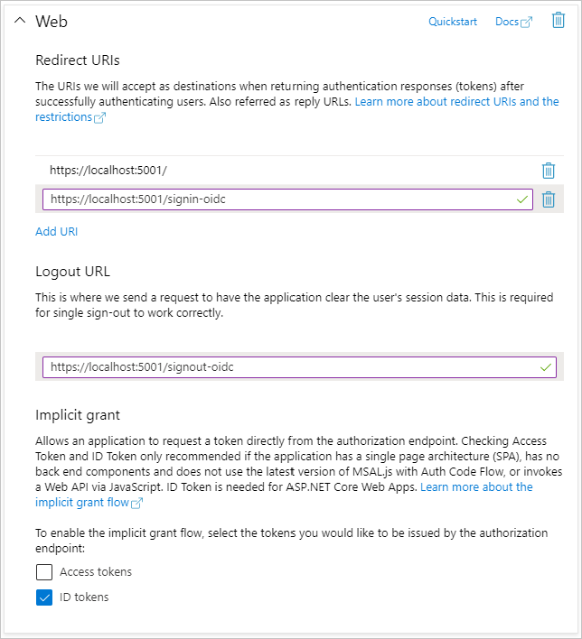

# <a name="how-to-run-the-completed-project"></a>完了したプロジェクトを実行する方法

## <a name="prerequisites"></a>前提条件

このフォルダーで完了したプロジェクトを実行するには、次のものが必要です。

- 開発用コンピューターにインストールされている [.Net コア SDK](https://dotnet.microsoft.com/download) 。 ( **注:** このチュートリアルは、.NET Core SDK バージョン3.1.201 を使用して作成されています。 このガイドの手順は、他のバージョンでは動作しますが、テストされていません。)
- Outlook.com 上のメールボックスを持つ個人の Microsoft アカウント、または Microsoft 職場または学校のアカウントのいずれか。

Microsoft アカウントを持っていない場合は、無料のアカウントを取得するためのオプションがいくつかあります。

- [新しい個人用 Microsoft アカウントにサインアップ](https://signup.live.com/signup?wa=wsignin1.0&rpsnv=12&ct=1454618383&rver=6.4.6456.0&wp=MBI_SSL_SHARED&wreply=https://mail.live.com/default.aspx&id=64855&cbcxt=mai&bk=1454618383&uiflavor=web&uaid=b213a65b4fdc484382b6622b3ecaa547&mkt=E-US&lc=1033&lic=1)することができます。
- [Office 365 開発者プログラムにサインアップ](https://developer.microsoft.com/office/dev-program)して、無料の office 365 サブスクリプションを取得することができます。

## <a name="register-a-web-application-with-the-azure-active-directory-admin-center"></a>Web アプリケーションを Azure Active Directory 管理センターに登録する

1. ブラウザーを開き、[Azure Active Directory 管理センター](https://aad.portal.azure.com)に移動します。 **個人用アカウント** (別名: Microsoft アカウント)、または **職場/学校アカウント** を使用してログインします。

1. 左側のナビゲーションで **[Azure Active Directory]** を選択し、それから **[管理]** で **[アプリの登録]** を選択します。

    

1. **[新規登録]** を選択します。 **[アプリケーションを登録]** ページで、次のように値を設定します。

    - `ASP.NET Core Graph Tutorial` に **[名前]** を設定します。
    - **[サポートされているアカウントの種類]** を **[任意の組織のディレクトリ内のアカウントと個人用の Microsoft アカウント]** に設定します。
    - **[リダイレクト URI]** で、最初のドロップダウン リストを `Web` に設定し、それから `https://localhost:5001/` に値を設定します。

    ![[アプリケーションを登録する] ページのスクリーンショット](../tutorial/images/aad-register-an-app.png)

1. **[登録]** を選択します。 **ASP.NET コアグラフのチュートリアル** ページで、 **アプリケーション (クライアント) ID** の値をコピーして保存します。そのためには、次の手順を実行する必要があります。

    

1. **[管理]** の下の **[認証]** を選択します。 [ **リダイレクト uri** ] で、値と共に URI を追加 `https://localhost:5001/signin-oidc` します。

1. **ログアウト URL** をに設定 `https://localhost:5001/signout-oidc` します。

1. **[暗黙的な許可]** セクションを検索し、 **[ID トークン]** を有効にします。 **[保存]** を選択します。

    

1. **[管理]** で **[証明書とシークレット]** を選択します。 
            **[新しいクライアント シークレット]** ボタンを選択します。 **[説明]** に値を入力して、 **[有効期限]** のオプションのいずれかを選び、 **[追加]** を選択します。

    ![[クライアントシークレットの追加] ダイアログのスクリーンショット](../tutorial/images/aad-new-client-secret.png)

1. このページを離れる前に、クライアント シークレットの値をコピーします。 次の手順で行います。

    > [!IMPORTANT]
    > このクライアント シークレットは今後表示されないため、この段階で必ずコピーするようにしてください。

    

## <a name="configure-the-sample"></a>サンプルを構成する

1. **Graphtutorial .csproj** が配置されているディレクトリでコマンドラインインターフェイス (CLI) を開き、次のコマンドを実行します `YOUR_APP_ID` 。アプリケーション ID は Azure portal から、 `YOUR_APP_SECRET` アプリケーションシークレットで置き換えます。

    ```Shell
    dotnet user-secrets init
    dotnet user-secrets set "AzureAd:ClientId" "YOUR_APP_ID"
    dotnet user-secrets set "AzureAd:ClientSecret" "YOUR_APP_SECRET"
    ```

## <a name="run-the-sample"></a>サンプルを実行する

CLI で、次のコマンドを実行してアプリケーションを起動します。

```Shell
dotnet run
```
